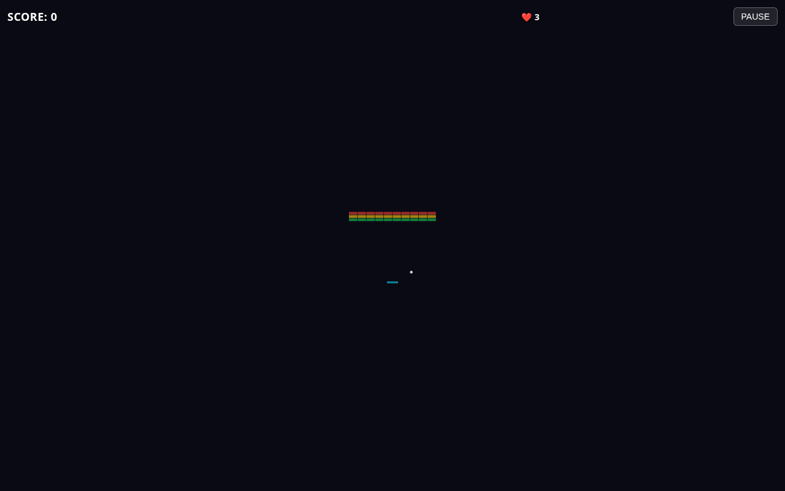

# 🧱 Brick Breaker

A classic brick-breaker game rebuilt from scratch in **Three.js**, deployed on **Cloudflare free tier** (Pages + Workers + KV).



---

## Features

- **3 hand-crafted levels** with regular, armored (multi-hit), and unbreakable bricks
- **Combo system** — chain hits within 1.5s window for up to 8x score multiplier
- **Power-ups** — multi-ball, expand paddle, slow ball (drops from broken bricks, ~10% chance)
- **Juice** — particle debris on brick break, camera shake on life loss, screen flash, WebAudio SFX
- **Mobile-friendly** — touch controls, responsive layout, haptic feedback (vibrate)
- **Pause** — P/Escape/button + auto-pause on tab blur
- **Global leaderboard** — HMAC-signed score submission, top-10 display
- **TDD-first** — 82 unit + worker tests + Playwright e2e

---

## Controls

| Action | Keyboard | Mouse / Touch |
|---|---|---|
| Move paddle | `←` `→` or `A` `D` | Move pointer / drag finger |
| Launch ball | `Space` | Click / tap |
| Pause | `P` or `Esc` | Pause button |
| Restart | `R` | Tap game-over overlay |
| Fullscreen | — | (coming) |

---

## Stack

- **Three.js** (vanilla, no R3F) — 3D scene with orthographic camera
- **Vite** — dev server + production bundler (~125 KB gzipped)
- **Vitest** — unit tests (core logic, 72 tests)
- **@cloudflare/vitest-pool-workers** — worker tests in workerd runtime (10 tests)
- **Playwright** — e2e smoke tests
- **Cloudflare Pages** — static hosting (free)
- **Cloudflare Workers + KV** — leaderboard backend (free)

---

## Architecture

See [docs/ARCHITECTURE.md](docs/ARCHITECTURE.md) for full design rationale and the [implementation checklist](IMPLEMENTATION.md).

### Boundaries

- `src/core/` — pure logic, no Three.js imports. Game state, physics, collision, power-ups, combo, score.
- `src/render/` — Three.js scene + mesh factories. Pure consumer of core state.
- `src/ui/` — DOM overlays (HUD, input manager).
- `src/net/` — leaderboard client (fetch + HMAC).
- `worker/` — Cloudflare Worker (separate deployable, HMAC verify + KV store).

---

## Local Development

```bash
npm install
npm run dev          # http://localhost:5173
npm test             # 82 unit + worker tests
npm run test:e2e     # Playwright smoke tests (needs dev server)
npm run lint         # ESLint + Prettier
npm run build        # production bundle in dist/
```

---

## Deploy to Cloudflare

### One-time setup

1. **Create Cloudflare account** at https://dash.cloudflare.com
2. **Create Pages project**:
   ```bash
   wrangler pages project create brickbreaker
   ```
   Or via dashboard: Workers & Pages → Create → Pages → Upload assets (we'll do this via GH).
3. **Create KV namespace** for the leaderboard:
   ```bash
   wrangler kv:namespace create SCORES
   wrangler kv:namespace create SCORES --preview
   ```
   Copy the IDs into `worker/wrangler.toml`.
4. **Generate HMAC secret**:
   ```bash
   openssl rand -hex 32
   ```
   Set it both as a GH secret (`VITE_HMAC_SECRET`) and as a worker secret (`wrangler secret put HMAC_SECRET`).

### GitHub secrets

Add these to your repo's Settings → Secrets and variables → Actions:

| Secret | Description |
|---|---|
| `CF_API_TOKEN` | Cloudflare API token with Workers + Pages edit |
| `CF_ACCOUNT_ID` | Cloudflare account ID |
| `VITE_HMAC_SECRET` | Same secret as worker (32-byte hex) |
| `HMAC_SECRET` | Set via `wrangler secret put HMAC_SECRET` |

### Deploy

```bash
git tag v0.1.0
git push origin v0.1.0
# GH Actions builds, deploys Pages, deploys Worker
```

Or manually:

```bash
npm run build
# upload dist/ via Cloudflare dashboard
cd worker && wrangler deploy
```

### Free tier

- Cloudflare Pages: unlimited requests, 500 builds/month
- Cloudflare Workers: 100,000 requests/day
- Cloudflare KV: 100,000 reads/day, 1,000 writes/day

Way more than a brick-breaker game needs.

---

## CI

`.github/workflows/ci.yml` runs on every push/PR:

1. Install deps (`npm ci`)
2. Lint (`eslint + prettier`)
3. Unit tests (`vitest --project unit`)
4. Worker tests (`vitest --project worker` in workerd)
5. Build (`vite build`)

`.github/workflows/deploy.yml` runs on `v*` tag push or manual dispatch:

1. Build with `VITE_HMAC_SECRET`
2. Deploy to Cloudflare Pages
3. Deploy worker with `wrangler deploy`

---

## License

Personal project. No license specified.

---

## Release notes

### v0.3.2 (2026-07-05)

- **Fix: outer bricks unreachable.** Spin influence bumped from 6 → 9 (max launch angle from vertical: 27° → 49°). With the wider angle, the ball can comfortably reach the outermost brick columns (cx ≈ ±8.5) with only ~75% paddle offset, instead of requiring a perfect edge hit. Also smooths gameplay on wider devices where the brick grid is larger than the default world. 96/96 tests pass (+3 reachability regression tests).

### v0.3.1 (2026-07-05)

- **Fix: ball stuck at ceiling.** `detectPaddleCollision` was passing the paddle object directly to `circleAabbHit`, which expects `{x, y, w, h}` while paddle uses `{x, y, width, height}`. NaN half-extents produced a phantom hit every frame after the ball touched the ceiling; `bounceBall` then flipped `vy` positive and pinned the ball at `y = halfH - r`. Fix normalizes the paddle to AABB shape before the hit test. Adds 2 unit tests + a 300-frame integration regression (`ceiling-stuck.test.js`). 93/93 tests pass.

### v0.3.0 (2026-07-04)

- Always-visible leaderboard panel (top 5, periodic refresh every 15s, highlights current player).
- Mute toggle with localStorage persistence.
- Reworked SFX (sine + triangle waves instead of harsh square/saw).
- Mobile stuck-recovery via `enforceMinSpeed` (min-speed enforcement every physics step).
- 82 unit + worker tests + Playwright e2e.
